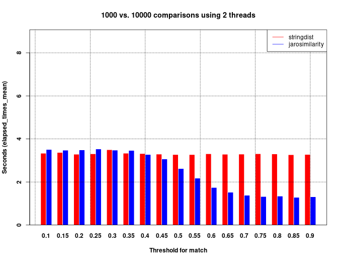

# jarosimilarity

An (unpublished) R-package *jarosimilarity*. The package does fuzzy matching between (multi-)sets of strings using the [Jaro-similarity](https://en.wikipedia.org/wiki/Jaro%E2%80%93Winkler_distance) algorithm.

## Motivation

When you want to approximate matches between two sets of strings, you'd do something like this (assuming you're using [stringdist-package](https://github.com/markvanderloo/stringdist)).


``` r
    matching_threshold <- 0.9
    for (str in strings1) {
        dist <- stringdist(str, strings2, method = "jw")
        matches_in_strings2 <- dist < ( 1 - threshold )
        # Do smth with matches..
    }
```

The idea is to find *matches* quicker than with the method above (*not* to calculate the distance faster) and with a smaller memory footprint.

## Usage & installation

See README of the package under [./pkg/README.md](./pkg/README.md)


## Implementation

The idea is to take the implementation of Jaro-Winkler from the [stringdist-package](https://github.com/markvanderloo/stringdist) as a starting point. The first step is strip away as much of the code as possible (stringdist supports multiple fuzzymatching algorithms so the code is more complicated). 

Differences to stringdist-package:
- Can only compare ASCII-strings
- Uses char pointers instead of unsigned integers to represent characters
- Does not return the jaro-similarity between strings. Returns matches (jarosimilarity above threshold-parameter)
- Can compare two sets with a single function call

Optimisations added:
1. Exit early if the number of matches is slow (no need to count transpositions)
2. Re-use memory instead of calling `malloc` for each comparison (and setting memory to zero with a loop)

+ other minor optimisations

## Performance

A comparison of the "stringdist-method" (see [above](#motivation)) and jarosimilarity-package. 

The test:
    - finding approximate matches between two sets of strings
    - the strings are random names from the imdb-dataset
    - the are 1000 and 10000 names in the sets, respectively. The size of the problem is then 1E3 * 1E4 = 1E7.
    - test is ran on 2 threads
    - different threshold for matching is tested. Each it it's own test.
    - each test is ran twice and the results averaged

See `./perf_test/` for more details.


The figure below shows the results by threshold and package. The time unit is seconds.



For this specific(!) task jarosimilarity outperforms strings. The running time is about half when the threshold is 0.9. As the plot indicates, jarosimilary performs better as the threshold increases. This is due to the exit early -strategy.